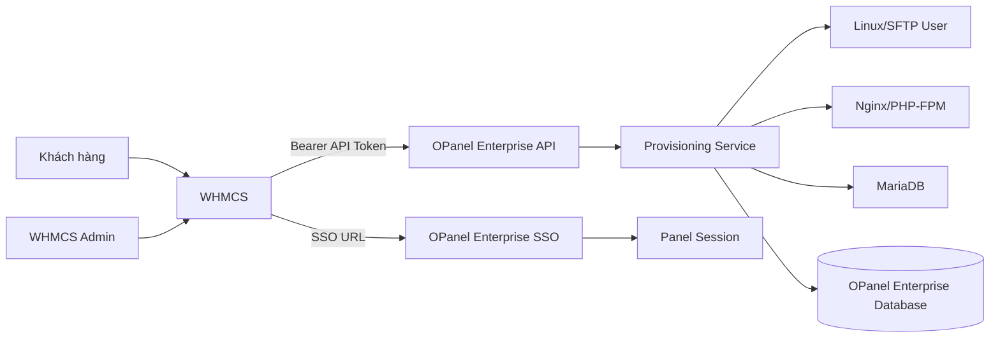

# Plan module bán hosting OPanel Enterprise tích hợp WHMCS

## 1. Kết luận khảo sát OPanel Enterprise

OPanel Enterprise đã có nền provisioning gần đủ:

- API token authentication.
- Scope `provisioning:manage`, `sso:create`.
- Hosting plans.
- Hosting accounts.
- Billing links.
- Provisioning jobs.
- Usage snapshots.
- SSO token một lần, hết hạn 60 giây.
- Endpoint create, suspend, unsuspend, terminate, đổi mật khẩu, đổi plan, usage.
- Audit log.
- Mapping `billing_system`, `billing_client_id`, `billing_service_id`.

OPanel Enterprise đã có sẵn phần backend chính. Không viết lại provisioning. Cần tập trung viết WHMCS module, hoàn thiện contract, idempotency, retry, webhook/usage và kiểm thử.

---

# 2. Kiến trúc tổng thể



## Nguyên tắc

1. WHMCS giữ:
   - Khách hàng.
   - Đơn hàng.
   - Sản phẩm.
   - Chu kỳ thanh toán.
   - Trạng thái thanh toán.
   - Dịch vụ.

2. OPanel Enterprise giữ:
   - Linux user.
   - Website.
   - Database.
   - SSL.
   - Backup.
   - Quota.
   - Runtime.
   - Panel session.

3. WHMCS module chỉ làm adapter:
   - Gọi API.
   - Mapping ID.
   - Xử lý lỗi.
   - Ghi module log.
   - Tạo SSO URL.

4. Không cho WHMCS truy cập DB OPanel Enterprise trực tiếp.

---

# 3. Phạm vi MVP

## Admin provisioning

Bắt buộc:

- `TestConnection`
- `CreateAccount`
- `SuspendAccount`
- `UnsuspendAccount`
- `TerminateAccount`
- `ChangePassword`
- `ChangePackage`
- `UsageUpdate`

## Client area

Bắt buộc:

- Login to Panel.
- Hiển thị username.
- Hiển thị domain.
- Hiển thị trạng thái hosting.
- Hiển thị storage usage.
- Hiển thị plan hiện tại.
- Hiển thị lỗi provisioning nếu có.

## Không đưa vào MVP

- Tự viết billing engine.
- Đồng bộ invoice.
- Reseller hierarchy.
- Domain registrar.
- Email hosting.
- cPanel migration.
- Marketplace.
- OAuth đầy đủ.
- Queue phân tán.
- Multi-server orchestration.

---

# 4. API contract OPanel Enterprise

Base URL:

```text
https://panel.example.com/api/v1
```

Header:

```http
Authorization: Bearer <OPanel_API_TOKEN>
Content-Type: application/json
Accept: application/json
```

Response chuẩn:

```json
{
  "success": true,
  "data": {},
  "error": null
}
```

Lỗi:

```json
{
  "success": false,
  "data": null,
  "error": "Plan not found or inactive"
}
```

## 4.1 Test connection

```http
GET /provisioning/plans
```

Dùng kiểm tra:

- URL đúng.
- API token đúng.
- Token còn hạn.
- Token có scope phù hợp.
- OPanel Enterprise hoạt động.

---

## 4.2 Lấy danh sách plan

```http
GET /provisioning/plans
```

WHMCS dùng để:

- Kiểm tra `plan_slug`.
- Đồng bộ thủ công.
- Hiển thị thông tin plan cho admin.

WHMCS product config nên lưu trực tiếp:

```text
plan_slug = basic
```

Không dùng tên plan làm khóa.

---

## 4.3 Tạo hosting account

```http
POST /provisioning/accounts
```

Payload đề xuất:

```json
{
  "username": "client123",
  "domain": "example.com",
  "password": "generated-password",
  "plan_slug": "basic",
  "billing_system": "whmcs",
  "billing_client_id": "456",
  "billing_service_id": "789"
}
```

Response cần chứa:

```json
{
  "success": true,
  "data": {
    "account_id": 123,
    "username": "client123",
    "domain": "example.com",
    "status": "active",
    "plan_slug": "basic"
  },
  "error": null
}
```

### Vấn đề cần fix trước MVP

API hiện tạo mới theo username/domain nhưng chưa thể hiện idempotency rõ ràng.

Thêm header:

```http
Idempotency-Key: whmcs-789-create
```

Hoặc payload:

```json
{
  "external_id": "whmcs:789"
}
```

OPanel Enterprise phải trả account cũ nếu WHMCS retry cùng request.

Lý do: WHMCS có thể timeout sau khi OPanel Enterprise đã tạo user. Retry hiện tại có thể tạo lỗi duplicate hoặc trạng thái không rõ.

---

## 4.4 Suspend

```http
POST /provisioning/accounts/{account_id}/suspend
```

Payload:

```json
{
  "reason": "WHMCS service suspended"
}
```

Suspend phải:

- Đổi trạng thái account.
- Disable panel user.
- Lock Linux user.
- Ngừng website.
- Ghi `ProvisioningJob`.
- Ghi audit log.

Suspend lặp lại nên trả trạng thái hiện tại, không gây lỗi cứng.

---

## 4.5 Unsuspend

```http
POST /provisioning/accounts/{account_id}/unsuspend
```

Unsuspend phải:

- Active panel user.
- Unlock Linux user.
- Active website.
- Ghi job.
- Ghi audit.

Unsuspend lặp lại nên idempotent.

---

## 4.6 Terminate

```http
DELETE /provisioning/accounts/{account_id}
```

Cần thêm tham số bảo vệ:

```json
{
  "confirm": true,
  "reason": "WHMCS service terminated"
}
```

Hoặc giữ `DELETE`, nhưng module phải yêu cầu:

```http
X-Confirm-Termination: true
```

Terminate phải có policy:

- `soft terminate`: khóa account, giữ dữ liệu trong thời gian retention.
- `hard terminate`: xóa website, Linux user, database, backup liên quan.

MVP nên dùng:

```text
soft terminate = mặc định
```

Hard delete cần tùy chọn admin riêng. Xóa ngay dễ mất dữ liệu do WHMCS thao tác nhầm.

---

## 4.7 Đổi mật khẩu

```http
POST /provisioning/accounts/{account_id}/change-password
```

Payload:

```json
{
  "password": "new-secure-password"
}
```

Không ghi password vào:

- WHMCS module log.
- OPanel Enterprise audit detail.
- Error message.
- Exception trace.

---

## 4.8 Đổi package

```http
POST /provisioning/accounts/{account_id}/change-plan
```

Payload:

```json
{
  "plan_slug": "business"
}
```

OPanel Enterprise cần xử lý:

- Plan tồn tại.
- Plan đang active.
- Giới hạn mới áp dụng ngay.
- Không xóa dữ liệu khi downgrade.
- Báo lỗi nếu usage vượt quota mới.
- Ghi lịch sử thay đổi plan.

Downgrade không nên tự xóa website hoặc file.

---

## 4.9 Lấy usage

```http
GET /provisioning/usage/{account_id}
```

Response:

```json
{
  "success": true,
  "data": {
    "account_id": 123,
    "storage_bytes": 524288000,
    "bandwidth_bytes": 1048576000,
    "database_count": 2,
    "email_count": 0,
    "website_count": 1,
    "snapshot_at": "2026-08-08T12:00:00"
  },
  "error": null
}
```

WHMCS dùng dữ liệu này để:

- Hiển thị usage.
- Tính overage nếu cần sau này.
- Cập nhật product usage.
- Hiển thị cảnh báo gần đầy quota.

---

# 5. Cấu trúc WHMCS module

Tạo module tại:

```text
/modules/servers/OPanel Enterprise/
```

Cấu trúc tối thiểu:

```text
modules/servers/OPanel Enterprise/
├── OPanel Enterprise.php
├── lib/
│   ├── ApiClient.php
│   ├── Config.php
│   ├── Response.php
│   ├── Sanitizer.php
│   └── Username.php
└── README.md
```

## Tối giản hơn cho MVP

Có thể bắt đầu một file:

```text
/modules/servers/OPanel Enterprise/OPanel Enterprise.php
```

Khi logic API vượt khoảng 200–300 dòng, tách `ApiClient.php`.

Không tạo framework riêng. WHMCS module API đơn giản.

---

# 6. Server module functions

## `OPanel_MetaData`

Khai báo:

- Display name.
- Version.
- Requires server.
- Supported functions.

## `OPanel_ConfigOptions`

Khai báo product options:

```text
Plan Slug
Default PHP Version
Auto Create Website
```

MVP chỉ cần:

```text
Plan Slug
```

## `OPanel_CreateAccount`

Luồng:

1. Đọc `$params`.
2. Validate:
   - domain.
   - username.
   - plan slug.
   - password.
3. Sinh password nếu WHMCS không cung cấp.
4. Gọi OPanel Enterprise.
5. Lưu `account_id` vào:
   - `serviceusername`, hoặc
   - module custom field.
6. Lưu username.
7. Ghi log đã scrub secret.
8. Trả `success`.

Mapping đề xuất:

| WHMCS | OPanel Enterprise |
|---|---|
| `$params['serviceid']` | `billing_service_id` |
| `$params['userid']` | `billing_client_id` |
| `$params['domain']` | `domain` |
| `$params['username']` | `username` |
| `$params['password']` | `password` |
| product config `Plan Slug` | `plan_slug` |
| `whmcs` | `billing_system` |

Không lưu OPanel Enterprise API token trong custom field.

## `OPanel_SuspendAccount`

- Đọc `account_id`.
- Nếu thiếu ID, thử lookup bằng `billing_service_id`.
- Gọi suspend.
- Thành công khi account đã `suspended`.
- Nếu account đã suspended, vẫn coi là thành công.

## `OPanel_UnsuspendAccount`

- Gọi unsuspend.
- Idempotent.
- Không tạo account mới.

## `OPanel_TerminateAccount`

- Gọi terminate.
- Kiểm tra response.
- Không xóa mapping WHMCS nếu cần retry hoặc audit.
- Chỉ xóa mapping sau khi OPanel Enterprise xác nhận thành công.

## `OPanel_ChangePassword`

- Validate password policy.
- Gọi API.
- Không log password.
- Không ghi password vào exception.

## `OPanel_ChangePackage`

- Lấy plan slug mới từ product config.
- Gọi change plan.
- Không gọi terminate/create lại.

## `OPanel_UsageUpdate`

- Gọi usage endpoint.
- Chuyển bytes sang MB nếu WHMCS cần.
- Trả usage theo format WHMCS.
- Không làm fail toàn bộ module khi snapshot tạm thời không có.

---

# 7. API client WHMCS

`ApiClient` cần có:

```php
get(string $path): array
post(string $path, array $payload): array
delete(string $path, array $payload = []): array
```

Yêu cầu:

- HTTPS bắt buộc production.
- Timeout kết nối: 5 giây.
- Timeout tổng: 20 giây.
- Tối đa 2 retry cho HTTP 502, 503, 504.
- Không retry HTTP 400, 401, 403, 404.
- Retry không lặp request terminate nếu chưa có idempotency.
- Kiểm tra HTTP status.
- Parse JSON.
- Kiểm tra `success`.
- Chặn response quá lớn.
- Log request method/path/status/thời gian.
- Scrub:
  - API token.
  - password.
  - SSO token.
  - Authorization header.

Nên dùng cURL native của PHP. Không thêm Composer dependency cho HTTP client.

---

# 8. Client-area SSO

## Endpoint OPanel Enterprise

```http
POST /sso/tokens
```

Payload:

```json
{
  "billing_system": "whmcs",
  "service_id": "789",
  "client_id": "456",
  "account_id": 123,
  "return_url": "https://billing.example.com/clientarea.php?action=productdetails&id=789"
}
```

OPanel Enterprise trả:

```json
{
  "success": true,
  "data": {
    "login_url": "https://panel.example.com/sso/login?token=..."
  },
  "error": null
}
```

## WHMCS client function

Có thể dùng một trong hai cách:

### Cách 1: Client area output

```php
function OPanel_ClientArea($params)
```

Hiển thị nút:

```text
Login to Panel
```

Nút gửi POST đến route local của module.

### Cách 2: Client area action

```php
function OPanel_ClientAreaCustomButtonArray()
```

Tên action:

```text
Login to Panel
```

Action:

1. Xác nhận khách hiện đăng nhập đúng service owner.
2. Lấy `account_id`.
3. Gọi OPanel Enterprise `/sso/tokens`.
4. Redirect trực tiếp đến `login_url`.
5. Không render token vào HTML.
6. Không đưa token vào URL WHMCS.
7. Không lưu login URL vào DB.

## Return URL

OPanel Enterprise chỉ chấp nhận domain allowlist:

```text
billing.example.com
```

Không nhận redirect URL tùy ý từ browser.

SSO token:

- Random bằng CSPRNG.
- Lưu hash.
- Dùng một lần.
- Hết hạn sau 60 giây.
- Đánh dấu `used_at` trong transaction.
- Chặn replay.
- Ghi audit success/failure.

---

# 9. Mapping WHMCS product

## Product custom fields

Tạo các custom fields:

| Field | Type | Giá trị |
|---|---|---|
| `OPanel Enterprise Account ID` | Admin only | `123` |
| `OPanel Enterprise Username` | Admin only | `client123` |
| `OPanel Enterprise Status` | Admin only | `active` |
| `OPanel Enterprise Last Error` | Admin only | lỗi gần nhất |

Không dùng `username` làm account ID. Account ID mới là khóa liên kết.

## Server configuration

WHMCS server:

```text
Name: OPanel Enterprise Production
Hostname: panel.example.com
IP Address: 43.167.210.203
Module: OPanel Enterprise
Username: whmcs-api
Password: <OPanel Enterprise API token>
Secure: On
Port: 443
```

Không đặt API token trong source code.

Một server WHMCS map tới một OPanel Enterprise server. Multi-server để phase sau.

---

# 10. Đồng bộ trạng thái

## OPanel Enterprise → WHMCS

MVP không cần webhook. WHMCS gọi chủ động:

- Khi admin mở service.
- Khi chạy `UsageUpdate`.
- Khi module action chạy.

Phase sau thêm:

```http
POST /api/v1/webhooks/whmcs
```

Nhưng webhook cần:

- HMAC signature.
- Timestamp.
- Replay protection.
- Event ID.
- Retry.
- Dead-letter log.

Không thêm webhook trước khi polling hoạt động ổn định.

---

# 11. Idempotency và retry

Đây là phần phải hoàn thiện trước khi production.

## Tạo account

Khóa duy nhất:

```text
billing_system + billing_service_id
```

Một service WHMCS chỉ được map tới một OPanel Enterprise account.

Nếu gọi create lần hai:

- Tìm `BillingLink`.
- Nếu account active, trả account đó.
- Nếu account suspended, trả account đó hoặc báo trạng thái rõ.
- Không tạo user mới.

## Suspend/unsuspend

Các trạng thái hợp lệ:

```text
active
suspended
terminated
```

Tác vụ lặp lại phải an toàn.

## Terminate

Nếu request timeout:

1. Gọi `GET /provisioning/accounts/{id}`.
2. Nếu đã terminated, xem như thành công.
3. Nếu chưa terminated, retry một lần.
4. Không tạo account mới.

---

# 12. Những điểm OPanel Enterprise cần bổ sung

## 12.1 Chuẩn hóa lỗi

Hiện `_err()` dùng `HTTPException.detail`. Cần đảm bảo WHMCS luôn nhận được:

```json
{
  "success": false,
  "data": null,
  "error": "message"
}
```

Không trả lỗi FastAPI dạng không đồng nhất.

## 12.2 Idempotency

Thêm:

- `external_id` hoặc `idempotency_key`.
- Unique constraint.
- Lookup trước provisioning.
- Job trạng thái rõ ràng.

## 12.3 Provisioning transaction

Hiện `create_account()` có thể:

1. Tạo Linux user.
2. Tạo DB user.
3. Tạo account row.
4. Tạo website.
5. Provision Nginx.

Nếu bước sau lỗi, dữ liệu có thể dở dang.

Cần thêm trạng thái:

```text
pending
provisioning
active
failed
suspended
terminated
```

Job phải lưu:

- Bước đang chạy.
- Lỗi.
- Payload không chứa password.
- Retry count.
- Thời gian bắt đầu/kết thúc.

## 12.4 Không nuốt lỗi provisioning

Đoạn hiện tại có log warning khi Nginx provisioning fail nhưng vẫn tiếp tục active:

```python
except Exception:
    logger.warning("Failed to provision nginx/site for %s", domain)
```

Production nên:

- Ghi job `failed`.
- Đặt account `failed`.
- Trả lỗi cho WHMCS.
- Không báo create thành công khi website chưa chạy.

## 12.5 Username normalization

WHMCS username phải qua cùng validator OPanel Enterprise:

- Chỉ lowercase.
- Chỉ ký tự an toàn.
- Độ dài giới hạn.
- Không bắt đầu bằng số nếu Linux policy không cho.
- Chặn reserved usernames.
- Không dùng domain raw làm username.

## 12.6 Database kiểu số

`UsageSnapshot.storage_bytes` và `bandwidth_bytes` đang dùng `Integer`.

Với filesystem lớn hoặc bandwidth cao, nên dùng `BigInteger`.

## 12.7 Unique billing link

Thêm unique constraint:

```text
billing_system + billing_service_id
```

Ngăn tạo nhiều mapping cho cùng WHMCS service.

## 12.8 API token quản lý

Cần có màn hình admin cho:

- Tạo token.
- Chỉ hiển thị plain token một lần.
- Gán scope.
- Gán `billing_system`.
- Đặt expiry.
- Revoke token.
- Xem last used.
- Giới hạn IP tùy chọn.

---

# 13. Bảo mật

## OPanel Enterprise API

- HTTPS.
- Bearer token.
- Hash token trong DB.
- Scope bắt buộc.
- Expiry.
- Revoke.
- Rate limit.
- IP allowlist cho WHMCS nếu có thể.
- Không trả secret trong response.
- Audit mọi tác vụ thay đổi dữ liệu.

## WHMCS module

- API token lưu trong server credentials của WHMCS.
- Không commit token vào Git.
- Không log Authorization header.
- Không log password.
- Không log SSO token.
- Validate URL OPanel Enterprise.
- Chỉ redirect HTTPS.
- Không tin `account_id` từ client browser; lấy từ service WHMCS.
- Kiểm tra client ID sở hữu service.

## Terminate

Cần xác nhận rõ vì thao tác có thể xóa dữ liệu. Multi-step confirmation dùng normal wording, không dùng shortcut gây hiểu nhầm.

---

# 14. Testing plan

## OPanel Enterprise tests

Tạo hoặc mở rộng:

```text
backend/app/tests/test_sso_provisioning.py
```

Test:

- Tạo account thành công.
- Duplicate username.
- Duplicate domain.
- Duplicate billing service.
- Sai API token.
- Sai scope.
- Sai `billing_system`.
- Suspend.
- Unsuspend.
- Terminate.
- Đổi password.
- Đổi plan.
- Usage không có snapshot.
- SSO token đúng.
- SSO token hết hạn.
- SSO token replay.
- Return URL ngoài allowlist.
- Token bị revoke.
- Idempotent create.

## WHMCS module tests

Không cần framework ở MVP. Viết test PHP nhỏ cho:

- Parse success response.
- Parse error response.
- Scrub secrets.
- Validate username.
- Validate plan slug.
- Retry HTTP 503.
- Không retry HTTP 401.
- Mapping account ID.

Một runnable check đủ cho logic nhỏ:

```php
assert(OPanel_sanitize_log('Bearer secret-token') === 'Bearer [REDACTED]');
```

## Manual integration test

1. Tạo product WHMCS.
2. Gán module `OPanel Enterprise`.
3. Gán `plan_slug`.
4. Tạo test client.
5. Tạo order.
6. Accept order.
7. Chạy Create.
8. Kiểm tra Linux user.
9. Kiểm tra website.
10. Kiểm tra Nginx.
11. Kiểm tra panel login.
12. Suspend.
13. Kiểm tra website bị khóa.
14. Unsuspend.
15. Đổi package.
16. Bấm Login to Panel.
17. Kiểm tra SSO one-time.
18. Chạy Usage Update.
19. Terminate test service.

---

# 15. Lộ trình triển khai

## Phase 0 — Chốt contract

- Chốt endpoint.
- Chốt response.
- Chốt mapping WHMCS/OPanel Enterprise.
- Chốt soft terminate.
- Chốt idempotency.
- Chốt plan slug.

Kết quả:

```text
docs/whmcs-api-contract.md
```

## Phase 1 — Ổn định OPanel Enterprise backend

- Idempotency create.
- Unique billing link.
- Chuẩn hóa lỗi.
- Trạng thái `failed`.
- Provisioning job rõ ràng.
- Không active account khi Nginx fail.
- BigInteger usage.
- Test provisioning/SSO.

## Phase 2 — Viết WHMCS module MVP

- `OPanel Enterprise.php`.
- Native cURL client.
- Config options.
- Create.
- Suspend.
- Unsuspend.
- Terminate.
- Change password.
- Change package.
- Usage.
- Module logging scrub secret.

## Phase 3 — SSO client area

- Nút `Login to Panel`.
- Gọi `/sso/tokens`.
- Redirect.
- Kiểm tra service ownership.
- Hiển thị lỗi ngắn.
- Không lưu token.

## Phase 4 — Admin usability

- Test connection.
- Hiển thị account ID.
- Hiển thị trạng thái.
- Hiển thị last provisioning error.
- Nút retry provisioning.
- Nút đồng bộ account.

## Phase 5 — Staging

- Cài OPanel Enterprise staging.
- Dùng WHMCS staging.
- Test toàn bộ vòng đời.
- Test timeout/retry.
- Test duplicate callback.
- Test rollback manual.

## Phase 6 — Production

- Tạo API token riêng cho WHMCS.
- Scope tối thiểu:
  - `provisioning:manage`
  - `sso:create`
- IP allowlist.
- HTTPS.
- Backup DB.
- Monitoring.
- Log rotation.
- Quy trình terminate thủ công.
- Runbook xử lý provisioning fail.

---

# 16. Definition of Done

Module đạt MVP khi:

- WHMCS tạo được account OPanel Enterprise.
- Retry Create không tạo duplicate account.
- WHMCS suspend/unsuspend đúng.
- WHMCS terminate đúng.
- Đổi password đồng bộ panel và SFTP.
- Đổi package cập nhật quota.
- Usage hiển thị đúng.
- Login to Panel hoạt động.
- SSO token dùng một lần.
- Token hết hạn sau 60 giây.
- Return URL bị kiểm soát.
- API token không xuất hiện trong log.
- Password không xuất hiện trong log.
- Mọi thao tác có audit.
- Test staging chạy đủ vòng đời.
- Có hướng dẫn cài module.
- Có hướng dẫn rollback.
- Có tài liệu mapping product.

---

# 17. Thứ tự viết tối ưu

1. Fix idempotency OPanel Enterprise.
2. Fix transaction/provisioning failure.
3. Viết `ApiClient.php`.
4. Viết `OPanel_CreateAccount`.
5. Viết suspend/unsuspend.
6. Viết change password.
7. Viết change package.
8. Viết terminate.
9. Viết usage.
10. Viết client-area SSO.
11. Viết test.
12. Chạy staging.
13. Đóng gói module ZIP.
14. Cài production.

Không viết HostBill adapter trong đợt đầu. API contract đã hỗ trợ HostBill; WHMCS adapter đủ để kiểm chứng mô hình. Adaptor HostBill thêm sau khi vòng đời WHMCS chạy ổn định.

Ngắn nhất: OPanel Enterprise đã có khoảng 70% backend cần thiết. Phần còn lại nằm ở idempotency, failure handling và WHMCS adapter.